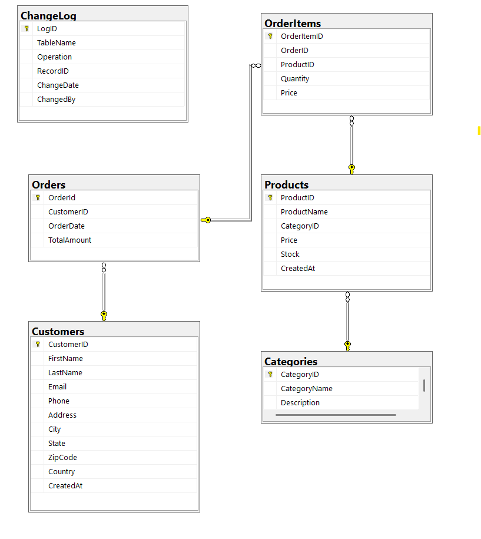

# 🛍 Online Retail Dashboard

An interactive Streamlit application for exploring and analyzing data from a fictional **Online Retail Company**. It connects to a SQL Server database (`OnlineRetailDB`) and provides: 📋 Table previews, 📊 Analytics dashboards, and 📝 Custom SQL query execution.

## 📂 Project Structure
```bash
├── app.py                   # Main Streamlit application  
├── OnlineRetailDBQueries.sql  # SQL script for DB, tables, data, queries, indexes, triggers, views  
├── requirements.txt         # Python dependencies  
```

## 📷 ER Diagram



## ⚙️ Requirements
- Python 3.8+
- Microsoft SQL Server (local or remote)
- Python libraries (from `requirements.txt`): `streamlit`, `pandas`, `pyodbc`

## 🗄️ Database Setup
1. Open SQL Server Management Studio (SSMS).  
2. Run `OnlineRetailDBQueries.sql` to create the `OnlineRetailDB` database with tables & sample data.  
3. Update the connection details in `app.py` if needed:  
   ```python
   pyodbc.connect(
       'DRIVER={SQL Server};'
       'SERVER=STARK\\SQLEXPRESS;'  # Change to your server instance
       'DATABASE=OnlineRetailDB;'
       'Trusted_Connection=yes;'
   )

## ⚙️ Create Virtual Environment
```bash
python -m venv venv
venv\Scripts\activate
pip install -r requirements.txt
```


## ▶️ RUN FILE
```bash
streamlit run app.py
